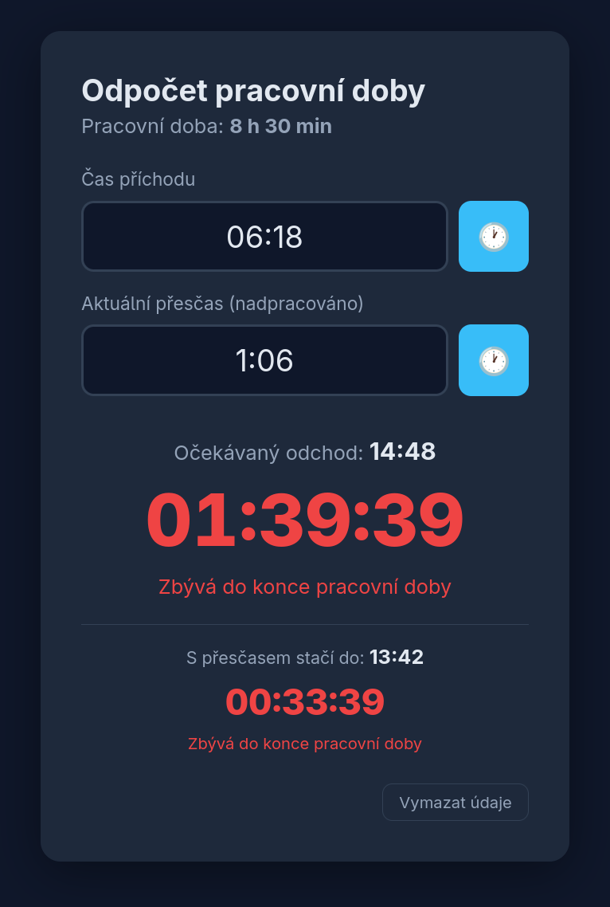

# Odpočet pracovní doby

Jednoduchá webová aplikace (Python / Flask): zadáš čas příchodu a dynamicky se
odpočítává pracovní doba **8 h 30 min**. Ukazuje také čas očekávaného odchodu.

## Náhled



## Funkce

- **Čas příchodu** – jde napsat **ručně** (formát `H:MM`, např. `6:00`),
  nebo klikni na ikonu 🕐 a vyber hodinu a minutu na **ciferníku**.
- **Živý odpočet** s přesností na sekundy do konce pracovní doby.
  - Dokud pracovní doba ubývá, je odpočet **červený**.
  - Jakmile je odpracováno 8 h 30 min a více, změní se na **zelený** a začne
    počítat nahoru s předponou `+` (kolik už máš odpracováno navíc).
- **Přesčas (nadpracováno)** – volitelně zadej již naspořený přesčas. O jeho
  délku se zkrátí potřebná pracovní doba a zobrazí se druhý odpočet
  „S přesčasem stačí do …“.
- **Ciferník** – hodinu i minutu vybereš klikem nebo tažením. Vnější prstenec
  jsou hodiny `1–12`, vnitřní `13–23` a `00`; minuty jdou po libovolné hodnotě.
- **Uložení v prohlížeči** – zadané hodnoty se ukládají do `localStorage`,
  takže přežijí obnovení stránky. Tlačítkem **Vymazat údaje** je vyčistíš.

Příklad: příchod `6:00` → očekávaný odchod `14:30`.
S přesčasem `0:30` → stačí odejít v `14:00`.

## Spuštění

### Docker Compose
```bash
docker compose up --build
```

### Podman Compose
```bash
podman-compose up --build
```

Poté otevři <http://localhost:13400>.

> **Adresa, na které aplikace poslouchá**, se nastavuje jen na jednom místě –
> proměnnou `BIND_ADDRESS` v `.env` (výchozí `127.0.0.1`, tj. dostupné jen
> z localhostu). Na serveru ji nastav na adresu, na kterou míří Cloudflare
> Tunnel, např. `BIND_ADDRESS=192.0.2.10`. Nic dalšího měnit není potřeba –
> healthcheck běží uvnitř kontejneru a na adrese hostu nezávisí.
>
> Pokud `cloudflared` běží na stejném stroji, nech `127.0.0.1` a v tunelu
> nastav `http://localhost:13400` – pak nejde hlavičky `CF-Connecting-IP` /
> `CF-IP*` (IP a poloha návštěvníka) podvrhnout obejitím Cloudflare.

### Start po rebootu (rootless Podman)
Rootless Podman nemá daemon, takže `restart: unless-stopped` po restartu
serveru kontejnery sám nespustí. Stack proto spouští systemd user unit
[`deploy/odpocet.service`](deploy/odpocet.service):

```bash
loginctl enable-linger "$USER"   # user služby běží i bez přihlášení
cp deploy/odpocet.service ~/.config/systemd/user/
systemctl --user daemon-reload
systemctl --user enable odpocet.service
```

Unit předpokládá repozitář v `~/Github/odpocetPracovniDoby` (jinak uprav
`WorkingDirectory`).

## Lokální spuštění (bez kontejneru)
```bash
pip install -r requirements.txt
python app.py
```

## Testy
```bash
pip install -r requirements-dev.txt
pytest
```

Integrační testy proti skutečné MySQL se spustí jen s nastaveným
`MYSQL_TEST_HOST`, např.:
```bash
podman run -d --rm --name odpocet-test-mysql -p 127.0.0.1:33306:3306 \
  -e MYSQL_DATABASE=odpocet -e MYSQL_USER=odpocet -e MYSQL_PASSWORD=testpw \
  -e MYSQL_ROOT_PASSWORD=rootpw docker.io/library/mysql:8.4
MYSQL_TEST_HOST=127.0.0.1 MYSQL_TEST_PORT=33306 MYSQL_PASSWORD=testpw pytest
```

## Struktura projektu

| Soubor / složka        | Účel                                                        |
| ---------------------- | ----------------------------------------------------------- |
| `app.py`               | Flask server, definice pracovní doby, běží na portu `13400` |
| `db.py`                | Připojení k MySQL, schéma a zápis tabulky `visits`           |
| `geo.py`               | Geolokace IP (Cloudflare hlavičky / ip-api.com fallback)     |
| `templates/index.html` | HTML šablona stránky                                         |
| `static/script.js`     | Logika odpočtu, přesčasu, ciferníku a ukládání              |
| `static/style.css`     | Vzhled                                                       |
| `Dockerfile`           | Obraz s Pythonem 3.12                                        |
| `docker-compose.yml`   | Spuštění kontejneru vč. healthchecku                        |

## Logování návštěv (MySQL)

Aplikace loguje každou návštěvu (mimo `/static/*` a healthcheck) do MySQL
tabulky `visits` – IP adresu, polohu (z Cloudflare hlaviček nebo fallback
`ip-api.com`), prohlížeč/OS/zařízení, hlavičky (bez `Cookie` a
`Authorization`) a další metadata. Tabulka se
vytvoří automaticky při startu (`db.py`).

Před spuštěním zkopíruj `.env.example` na `.env` a nastav hesla:
```bash
cp .env.example .env
```

Proměnné prostředí (výchozí hodnoty pro `docker compose`):

| Proměnná            | Účel                                   |
| ------------------- | --------------------------------------- |
| `MYSQL_PASSWORD`     | heslo uživatele `odpocet`               |
| `MYSQL_ROOT_PASSWORD`| root heslo MySQL kontejneru              |
| `BIND_ADDRESS`       | adresa hostu pro port `13400` (výchozí `127.0.0.1`) |

Pro přesnější geolokaci (bez závislosti na externím API) povol v Cloudflare
dashboardu **Rules → Managed Transforms → "Add visitor location headers"** –
aplikace pak automaticky použije `CF-IPCountry`, `CF-IPCity`,
`CF-IPLatitude/Longitude` atd.

## Nastavení pracovní doby

Délka pracovní doby je jediná konstanta v `app.py`:

```python
WORK_MINUTES = 8 * 60 + 30  # 8 h 30 min
```
